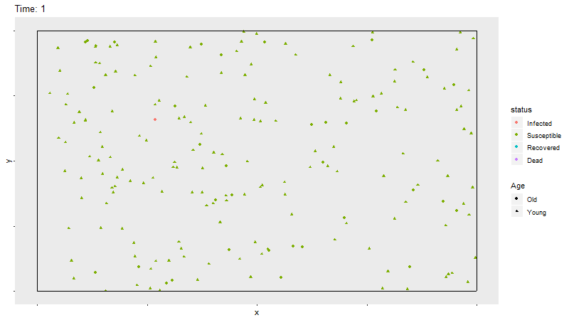
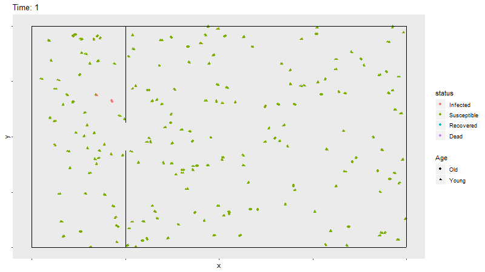

2020 has been a wild year. COVID 19 has everyone reeling, trying to figure out what this means for us. So many conversations and initiatives surround the idea of trying to "flatten the curve." Some obsessively check the CDC update of the number of cases in their home country or use percents of those infected to convince themselves this isn't that bad. 

I am no expert on infections, but I also have been thinking about the impact of COVID 19 recently. I tend to gravitate to numbers or graphics when there is so much we don't know. As Coronavirus has become the topic of most discussions recently, I have seen simulations of how the virus spreads. Examples of simulations I have seen are from the [Washington Post](https://www.washingtonpost.com/graphics/2020/world/corona-simulator/) or [this graphic](https://i.imgur.com/adhdxYM.gifv) on imgur.com. These graphics show a very clear reason for why we should stay aside, stop moving, or take other *social distancing* measures. I thought it would be intersting to replicate this type of simulation myself in `R`. 

In this post, I will show how to create similar simulations. Hopefully, anyone who wants to create a similar study or change the simulation can use this as a resource to do so. In my simulations, I will demonstrate 1) an infection with no infection control, 2) an infection with $85\%$ of the population not moving, 3) an infection with a barrier around an infected subpopulation, 4) an infection with both methods of infection control. The population not moving is representative of individual isolation efforts and the barrier is representative of transnational travel restrictions. 


```{r setup, echo = FALSE, message = FALSE, warning = FALSE}
library(dplyr)
library(ggplot2)
library(gganimate)
library(plyr)

set.seed(1)
```

## Initial Population

The first step for these simulations is defining the initial population. I will simulate $200$ observations and allow them to move within a $1\times1$ block. I want the observaitions to move in random directions, at random speeds. If an infected observation gets too close to a sesceptible one, the infection is spread. I also want the possiblity of death for elderly, infected observations that is dependent on the current number infected. This way I can assess death toll under the different methods.

```{r initialObs}
nobs <- 200
start.directions <- runif(nobs,0,360)
```

The directions are randomly selected in degrees, and the $x$/$y$ directions are calculated using this number. In the code defining the initial data frame, the $200$ observations each have a random $(x,y)$ starting coordinates, the direction in $x$ and $y$ (calculated from the sampled angles), the speed of movement (sampled uniformly between $.0025$ and $.005$), the age (old or young, sampled at $15\%$ old), the current infected status (the first observation infected and the rest susceptible), and the time since infection ($1$ for the first and $0$ for the rest).

```{r start.data}
start.patients <- data.frame(obs = 1:nobs,
                         x = runif(nobs), y = runif(nobs), 
                         xdir = cos(start.directions * pi / 180), 
                         ydir = sin(start.directions * pi / 180), 
                         speed = runif(nobs, .0025, .005), 
                         Age = sample(c("Young", "Old"), nobs, replace = TRUE, prob = c(.85,.15)), 
                         status = factor(c("Infected", rep("Susceptible",199)), 
                                         levels = c("Infected", "Susceptible", "Recovered", "Dead")), 
                         timeSinceInfect = c(1,rep(0,nobs-1)), time = 1)
```

These locations and the directions can be displayed in a plot. I used the `ggplot2` and `gganimate` libraries for these simulations. The speed is multiplied by $10$, so that it is shown how far an observation will move after $10$ frames, so that the direction is more clear. The observations are randomly assigned a starting place, direction, and speed.



```{r gapminder, fig.show='animate', ffmpeg.format='gif', dev='jpeg'}
ggplot(start.patients, aes(x = x, y = y, 
                           xend = x + 10 * speed * xdir,
                           yend = y + 10 * speed * ydir, 
                           shape = Age, color = status)) +
  geom_point() + 
  geom_segment(arrow = arrow(length=unit(0.10,"cm"), type = "closed")) + 
  theme(panel.grid = element_blank(), axis.text = element_blank()) +
  ggtitle("Patient Movement") +
  xlab(NULL) +
  ylab(NULL) + 
  geom_segment(aes(x = rep(c(0,0,0,1),50), xend = rep(c(1,1,0,1),50), 
                   y = rep(c(0,1,0,0),50), yend = rep(c(0,1,1,1),50)),
               color = "black")
```

<details>
  <summary>Code for above plot</summary>
```{r, echo=TRUE, eval=FALSE}
ggplot(start.patients, aes(x = x, y = y, 
                           xend = x + 10 * speed * xdir,
                           yend = y + 10 * speed * ydir, 
                           shape = Age, color = status)) +
  geom_point() + 
  geom_segment(arrow = arrow(length=unit(0.10,"cm"), type = "closed")) + 
  theme(panel.grid = element_blank(), axis.text = element_blank()) +
  ggtitle("Patient Movement") +
  xlab(NULL) +
  ylab(NULL)

```
</details>

With the starting population defined, now I will simulate movement, infection spread, recovery, and death.

## Simulation with No infection Control

There are many different pieces involved with this simulation; I will start by outlining the different pieces of a function that takes a population and moves it to the next time period. This function will be called `movement.noRestrictions`, and takes as an input `prev.data`, or the dataframe of the observations in the previous point in time. 

### Movement

The first piece of this function is determining the updated position and direction of the observations, or people. For each person, the idea is that their new position will be the old $(x,y)$ coordinates, plus the $(x,y)$ direction multiplied by the speed. If this new position would be outside of the box, then they need to "bounce". If the person is dead, there is no movement, direction, or speed.

```{r ifDead, eval = FALSE}
if(prev.data$status[i] == "Dead") {
      new.x[i] <- prev.data$x[i]
      new.xdir[i] <- 0
      new.y[i] <- prev.data$y[i]
      new.ydir[i] <- 0
      prev.data$speed[i] <- 0
}
```

If the updated direction would put it past the wall on the right or left, the new position must put it back inside the box. The new position would put it inside the box by however far outside the box it would have reached, had there been no wall. In this case, the new $x$ direction becomes the negative of the previous $x$ direction.

```{r ifLeftRightBounce, eval = FALSE}
else if(prev.data$x[i] + prev.data$speed[i] * prev.data$xdir[i] > 1) {
  new.x[i] <- 1 - (prev.data$x[i] + prev.data$speed[i] * prev.data$xdir[i] - 1)
  new.xdir[i] <- -prev.data$xdir[i]
      
} else if(prev.data$x[i] + prev.data$speed[i] * prev.data$xdir[i] < 0) {
    new.x[i] <- -(prev.data$x[i] + prev.data$speed[i] * prev.data$xdir[i])
    new.xdir[i] <- -prev.data$xdir[i]
}
```

If there would be no bounce, the new coordinates are simple and the direction remains unchanged.

```{r noBounce, eval = FALSE}
else{
  new.x[i] <- prev.data$x[i] + prev.data$speed[i] * prev.data$xdir[i]
  new.xdir[i] <- prev.data$xdir[i]
}
```

The same concept is applied to the $y$ direction.
<details>
  <summary>Code for $y$ direction movement</summary>
```{r, echo=TRUE, eval=FALSE}
if(prev.data$y[i] + prev.data$speed[i] * prev.data$ydir[i] > 1) {
  new.y[i] <- 1 - (prev.data$y[i] + prev.data$speed[i] * prev.data$ydir[i] - 1)
  new.ydir[i] <- -prev.data$ydir[i]

} else if(prev.data$y[i] + prev.data$speed[i] * prev.data$ydir[i] < 0) {
  new.y[i] <- -(prev.data$y[i] + prev.data$speed[i] * prev.data$ydir[i])
  new.ydir[i] <- -prev.data$ydir[i]
  
} else{
  new.y[i] <- prev.data$y[i] + prev.data$speed[i] * prev.data$ydir[i]
  new.ydir[i] <- prev.data$ydir[i]
}
```
</details>

### Infection Status

The next detail of the simulation is the spread of the infection and status of the people. The updated status of each person is assumed to remain unchanged, unless any of a few conditions are met. The first, is that if a person has been infected for more than $160$ time periods, that person recovers. Next, if any of the *neighbors* of a susceptible person are infected, that person will become infected. A neighbor is defined by any other person that is within $.05$, defined by the equation $\sqrt{(x_{person}-x_{other})^2+(y_{person}-y_{other})^2}\le.05$. Lastly, if a person is old and infected, that person has a chance of dying. I will make this chance $p$ dependent on how many people are currently infected $n$, defined by the simple function $p=\frac{n}{200}*.05$. 

Thus the status of each person is defined by the following code.
```{r statusChanges, eval = FALSE}
new.status[i] <- as.character(prev.data$status[i])

neighbors <- prev.data$obs[-i][(sqrt((new.y[-i]-new.y[i])^2 + (new.x[-i]-new.x[i])^2) < .05)]

if(prev.data$timeSinceInfect[i] > 160) {
  new.status[i] <- "Recovered"
  
} else if("Infected" %in% prev.data$status[neighbors] & prev.data$status[i] == "Susceptible") {
  new.status[i] <- "Infected"

} else if(new.status[i] == "Infected" & prev.data$Age[i] == "Old") {
  perc.infected <- mean(prev.data$status == "Infected")
  new.status[i] <- sample(c("Infected", "Dead"), 1, prob = c(1-perc.infected*.05,perc.infected*.05))
}
```

The last steps for the `movement.noRestrictions` function are updating the time since contraction for each infected person and outputing a dataframe with the updated values. The output of this function will be read in as an input for each change in time.

<details>
  <summary>Full code for the `movement.noRestrictions` function</summary>
```{r movementFunc}
movement.noRestrictions <- function(prev.data){
  new.x <- c()
  new.xdir <- c()
  new.y <- c()
  new.ydir <- c()
  new.status <- c()
  new.timeSinceInfect <- c()
  
  for(i in 1:nobs){
    ### Locations and Directions
    
    # If the person is dead, they no longer move
    if(prev.data$status[i] == "Dead") {
      new.x[i] <- prev.data$x[i]
      new.xdir[i] <- 0
      new.y[i] <- prev.data$y[i]
      new.ydir[i] <- 0
      prev.data$speed[i] <- 0
      
    # If it bounces off the right wall,
    } else if(prev.data$x[i] + prev.data$speed[i] * prev.data$xdir[i] > 1) {
      # Then the new X position is 1 - (how far past 1 it would have gone without the wall)
      new.x[i] <- 1 - (prev.data$x[i] + prev.data$speed[i] * prev.data$xdir[i] - 1)
      # and the new X direction is opposite
      new.xdir[i] <- -prev.data$xdir[i]
      
    # Else if it bounces off the left wall
    } else if(prev.data$x[i] + prev.data$speed[i] * prev.data$xdir[i] < 0) {
      new.x[i] <- -(prev.data$x[i] + prev.data$speed[i] * prev.data$xdir[i])
      new.xdir[i] <- -prev.data$xdir[i]
      
    # Otherwise, the new position is within the bounds
    } else{
      # Then the new X position is the previous plus the movement in that direction
      new.x[i] <- prev.data$x[i] + prev.data$speed[i] * prev.data$xdir[i]
      # and the new X direction is unchanged
      new.xdir[i] <- prev.data$xdir[i]
      }
    
    if(prev.data$status[i] == "Dead") {
      new.x[i] <- prev.data$x[i]
      new.xdir[i] <- 0
      new.y[i] <- prev.data$y[i]
      new.ydir[i] <- 0
      prev.data$speed[i] <- 0
      
    # If it bounces off the ceiling,
    } else if(prev.data$y[i] + prev.data$speed[i] * prev.data$ydir[i] > 1) {
      new.y[i] <- 1 - (prev.data$y[i] + prev.data$speed[i] * prev.data$ydir[i] - 1)
      new.ydir[i] <- -prev.data$ydir[i]
    
    # Bounces off the floor
    } else if(prev.data$y[i] + prev.data$speed[i] * prev.data$ydir[i] < 0) {
      new.y[i] <- -(prev.data$y[i] + prev.data$speed[i] * prev.data$ydir[i])
      new.ydir[i] <- -prev.data$ydir[i]
      
    # Does not bounce off ceiling nor floor
    } else{
      new.y[i] <- prev.data$y[i] + prev.data$speed[i] * prev.data$ydir[i]
      new.ydir[i] <- prev.data$ydir[i]
    }
  }
  
  for(i in 1:nobs){
    ### Status Changes
    
    # Continue with previous status
    new.status[i] <- as.character(prev.data$status[i])
    
    # Determine which other observations are the neighbors
    neighbors <- prev.data$obs[-i][(sqrt((new.y[-i]-new.y[i])^2 + (new.x[-i]-new.x[i])^2) < .05)]
    
    # If the subject has been infected for over 160, they recover
    if(prev.data$timeSinceInfect[i] > 160) {
      new.status[i] <- "Recovered"
      
    # If the subject is susceptible, and at least one neighbor is infected, then the subject is as well
    } else if("Infected" %in% prev.data$status[neighbors] & prev.data$status[i] == "Susceptible") {
      new.status[i] <- "Infected"
    
    # If the subject is infected and old, then the subject has a chance of becoming dead
    } else if(new.status[i] == "Infected" & prev.data$Age[i] == "Old") {
      perc.infected <- mean(prev.data$status == "Infected")
      new.status[i] <- sample(c("Infected", "Dead"), 1, prob = c(1-perc.infected*.05,perc.infected*.05))
    }
    
    # If infected, the infection timer increases
    if(new.status[i] == "Infected") {
      new.timeSinceInfect[i] <- prev.data$timeSinceInfect[i] + 1
    } else {
      new.timeSinceInfect[i] <- 0
    }
  }
  
  # Relevel Status
  new.status <- factor(new.status, levels = c("Infected", "Susceptible", "Recovered", "Dead"))
  
  # Output dataframe after one time of movement
  data.frame(obs = 1:nobs, x = new.x, y = new.y, 
             xdir = new.xdir, ydir = new.ydir, 
             speed = prev.data$speed, 
             Age = prev.data$Age, status = new.status, 
             timeSinceInfect = new.timeSinceInfect, 
             time = prev.data$time + 1)
}
```
</details>

### Full Simulated Data

I will make $400$ frames, or times, in this simulation. For the other simulations, by trial and error I found times when the infection was done spreading. The initial age, directions, positions, and speeds are already defined by `start.patients`. For each of the $400$ times, movement is simulated using `movement.noRestrictions`. Each update is saved into a new element in a list, and then collapsed into a single dataframe using `bind_rows`.

```{r DataNoFlattening}
time1 <- 400
times <- 1:time1
infect.data <- list()

infect.data[[1]] <- start.patients

for(time in times[-1]){
  infect.data[[time]] <- movement.noRestrictions(infect.data[[time - 1]])
}

full_infect <- bind_rows(infect.data)
full_infect$status <- factor(full_infect$status, levels = c("Infected", "Susceptible", "Recovered", "Dead"))
```

Using `gganimate`, a gif of the movement and status for each person is shown. The `magick` library is able to save the gif as a shareable file. In R Markdown, the option `fig.show='animate'` is included in the chunk options to display the gif. If not knitting in R Markdown, the gif will be displayed in the Viewer of Rstudio. The `magick::image_write` function writes the gif to a saved file as well. The gif may take a few minutes to render. I have found that with more frames in the gif, the rendering time increases exponentially.

```{r Animation.NoRestrictions, fig.show='animate', ffmpeg.format='gif', dev='jpeg', eval = FALSE}
p <- ggplot(full_infect, aes(x = x, y = y, color = status)) +
  geom_point(aes(shape=Age)) +
  transition_time(time) +
  ggtitle(paste("Time: {round(frame_time,0)}")) +
  theme(panel.grid = element_blank(),
        axis.text = element_blank()) + 
  geom_segment(aes(x = rep(c(0,0,0,1),time1*nobs/4), xend = rep(c(1,1,0,1),time1*nobs/4), 
                   y = rep(c(0,1,0,0),time1*nobs/4), yend = rep(c(0,1,1,1),time1*nobs/4)),
               color = "black")

anim <- animate(p, width = 800, height = 450)
magick::image_write(anim, "No_Restrictions.gif")
```


The movement can be summarized into a single plot that shows the population composition over time.

```{r curveNoRestrictions, fig.width = 8, fig.height = 3, echo = FALSE}
full_infect %>%
  group_by(time, status) %>%
  dplyr::summarize(number = dplyr::n()) %>%
  ggplot(aes(x = time, y = number/nobs, fill = status)) + 
  geom_bar(stat="identity", width = 1) + 
  labs(title = "Population ", x = "Time", y = "Percent of Population")
```


<details>
  <summary>Code for above plot</summary>
```{r curveNoRestrictionscomment, fig.width = 8, fig.height = 3, eval = FALSE}
full_infect %>%
  group_by(time, status) %>%
  dplyr::summarize(number = dplyr::n()) %>%
  ggplot(aes(x = time, y = number/nobs, fill = status)) + 
  geom_bar(stat="identity", width = 1) + 
  labs(title = "Population ", x = "Time", y = "Percent of Population")
```
</details>

## Simulation with Less Movement

The same process as above is simulated, but with roughly $85\%$ of the population not moving. I will assume that the infected individual is still moving. Instead of making significant changes to the previous simulation, I will simply take the `start.patients` dataframe, and give $0$ for $85\%$ of the values in the `speed` column.

```{r no.Speed}
no.move.start.patients <- start.patients
new.speeds <- c(start.patients$speed[1], ifelse(sapply(2:nobs,function(x) rbinom(1,1,.85)==1),0,start.patients$speed[-1]))
no.move.start.patients$speed <- new.speeds
```

From here, the simulation is repeated exactly the same as above, but starting with `no.move.start.patients` instead of `start.patients`.

```{r DataNoMove, echo = FALSE}
time2 <- 650
times <- 1:time2
infect.data <- list()

infect.data[[1]] <- no.move.start.patients

for(time in times[-1]){
  infect.data[[time]] <- movement.noRestrictions(infect.data[[time - 1]])
}

full_infect <- bind_rows(infect.data)
full_infect$status <- factor(full_infect$status, levels = c("Infected", "Susceptible", "Recovered", "Dead"))
```

```{r AnimateNoMove, fig.show = 'animate', echo = FALSE, ffmpeg.format='gif', dev='jpeg', eval = FALSE}
p <- ggplot(full_infect, aes(x = x, y = y, color = status)) +
  geom_point(aes(shape=Age)) +
  transition_time(time) +
  ggtitle(paste("Time: {round(frame_time,0)}")) +
  theme(panel.grid = element_blank(),
        axis.text = element_blank()) + 
  geom_segment(aes(x = rep(c(0,0,0,1),time2*nobs/4), xend = rep(c(1,1,0,1),time2*nobs/4), 
                   y = rep(c(0,1,0,0),time2*nobs/4), yend = rep(c(0,1,1,1),time2*nobs/4)),
               color = "black")

anim <- animate(p, width = 800, height = 450)
magick::image_write(anim, "Less_Movement.gif")
```


```{r curveNoMove, fig.width = 8, fig.height = 3, echo = FALSE}
full_infect %>%
  group_by(time, status) %>%
  dplyr::summarize(number = dplyr::n()) %>%
  ggplot(aes(x = time, y = number/nobs, fill = status)) + 
  geom_bar(stat="identity", width = 1) + 
  labs(title = "Population ", x = "Time", y = "Percent of Population")
```

## Simulation with Barriers

Simulating with a barrier is a more complicated social distancing method to simulate than less movement. The `movement.noRestrictions` function will need some changes in order to work. The updated movement function will be called `movement.withBarriers`. The barrier I am imagining is a vertical wall dividing about $1/4$ of the space, with a small opening in the middle to allow for limited movement across the barrier. This type of simulation is similar to infection spread with travel restrictions or quarantines. This boundary can be seen in the plot below. 

```{r start.plot.barrier, echo = FALSE}
ggplot() + 
   geom_segment(aes(x = rep(c(.25,.25,0,1,0,0,0,0,0,0),20), xend = rep(c(.25,.25,0,1,1,1,1,1,1,1),20), 
                   y = rep(c(0,1,0,0,0,1,1,1,1,1),20), yend = rep(c(.4375,.5625,1,1,0,1,1,1,1,1),20)), color = "black") +
  theme(panel.grid = element_blank(),
        axis.text = element_blank()) + 
  labs(title = "Patient Movement", x = NULL, y = NULL)
```

<details>
  <summary>Code for above plot</summary>
```{r start.plot.barrier.comment, eval = FALSE}
ggplot() + 
   geom_segment(aes(x = rep(c(.25,.25,0,1,0,0,0,0,0,0),20), xend = rep(c(.25,.25,0,1,1,1,1,1,1,1),20), 
                   y = rep(c(0,1,0,0,0,1,1,1,1,1),20), yend = rep(c(.4375,.5625,1,1,0,1,1,1,1,1),20)), color = "black") +
  theme(panel.grid = element_blank(),
        axis.text = element_blank()) + 
  labs(title = "Patient Movement", x = NULL, y = NULL)
```
</details>

Instead of handling movement as before, the movement needs to be redefined. The $x$ location of the starting infected person will be sampled in the walled off region. For reasons that will be later explained, the quadrant (either within the walls or not) is also assigned for each person.

```{r}
start.patients$x[1] <- runif(1,0,.25)
start.patients$quadrant <- ifelse(start.patients$x < .25, 1, 2)
```


```{r start.plot.barrier.move, echo = FALSE}
ggplot(start.patients, aes(x = x, y = y, 
                           xend = x + 10 * speed * xdir,
                           yend = y + 10 * speed * ydir, 
                           shape = Age, color = status)) +
  geom_point() + 
  geom_segment(arrow = arrow(length=unit(0.10,"cm"), type = "closed")) + 
  theme(panel.grid = element_blank(), axis.text = element_blank()) +
  ggtitle("Patient Movement") +
  geom_segment(aes(x = rep(c(.25,.25,0,1,0,0,0,0,0,0),20), xend = rep(c(.25,.25,0,1,1,1,1,1,1,1),20), 
                   y = rep(c(0,1,0,0,0,1,1,1,1,1),20), yend = rep(c(.4375,.5625,1,1,0,1,1,1,1,1),20)), color = "black") + 
  theme(panel.grid = element_blank(),
        axis.text = element_blank()) + 
  labs(x = NULL, y = NULL)
```

### Movement  

The other piece that needs to be changed from before is the bounces off these walls. The updated `movement.withBarriers` function will include the following conditions for the movements in $x$ before the outer wall bouncing conditions to fix for the new walls. First, for a "bounce" to occur on the wall, the person would have to cross the $x=.25$ line. If a person does cross this line, I calculate the $y$ coordinate at the point at which the $x=.25$. If the $y$ coordinate is outside of the gap area, then there is a bounce. This bounce is calculated as with the outer walls. Otherwise, the person moves normally.

```{r x.move, eval = FALSE}
else if((prev.data$x[i] - .25) * ((prev.data$x[i] + prev.data$speed[i] * prev.data$xdir[i]) - .25) < 0) {
  if(prev.data$x[i] < .25){
    y.at.imp <- prev.data$y[i] + 
      prev.data$speed[i] * prev.data$ydir[i] * 
        (.25 - prev.data$x[i]) / (prev.data$speed[i] * prev.data$xdir[i])
  } else{
    y.at.imp <- prev.data$y[i] + 
      prev.data$speed[i] * prev.data$ydir[i] * 
        (prev.data$x[i] - .25) / (prev.data$speed[i] * prev.data$xdir[i])
  }
  
  if(!((y.at.imp > .4375) & (y.at.imp < .5625))){
    if(prev.data$x[i] < .25){
      new.x[i] <- .25 - 
        (prev.data$x[i] + prev.data$speed[i] * prev.data$xdir[i] - .25)
    } else{
      new.x[i] <- .25 + 
        (.25 - prev.data$x[i] + prev.data$speed[i] * prev.data$xdir[i] - .25)
    }
    
    new.xdir[i] <- -prev.data$xdir[i]
  }
}
```

### Infection Status

Another change that needs to be made is that infections should not spread across the wall, so I will fix that by indicating whether or not the data are within the walls (columns marked `quadrant`), which is updated with the same function as initially used, in each movement. Thus now neighbors have to be within $.05$ and they have to be in the same `quadrant`. Even though this means that points on opposing sides of the gap area cannot spread the infection, this is a minor detail and may actually replicate transnational travel.

```{r quadrant, eval = FALSE}
neighbors <- prev.data$obs[-i][(sqrt((new.y[-i]-new.y[i])^2 + (new.x[-i]-new.x[i])^2) < .05)]
neighbors <- neighbors[which(prev.data$quadrant[-i][neighbors] == prev.data$quadrant[i])]
```

<details>
  <summary>Full code for the `movement.withBarriers` function</summary>
```{r movementFuncBarrier}
movement.withBarrier <- function(prev.data){
  new.x <- c()
  new.xdir <- c()
  new.y <- c()
  new.ydir <- c()
  new.status <- c()
  new.timeSinceInfect <- c()
  
  for(i in 1:nobs){
    ### Locations and Directions
    
    # If the person is dead, they no longer move
    if(prev.data$status[i] == "Dead") {
      new.x[i] <- prev.data$x[i]
      new.xdir[i] <- 0
      new.y[i] <- prev.data$y[i]
      new.ydir[i] <- 0
      prev.data$speed[i] <- 0
      
    # If it bounces off the mid walls,
    } else if((prev.data$x[i] - .25) * ((prev.data$x[i] + prev.data$speed[i] * prev.data$xdir[i]) - .25) < 0) {
      if(prev.data$x[i] < .25){
        y.at.imp <- prev.data$y[i] + 
          prev.data$speed[i] * prev.data$ydir[i] * 
            (.25 - prev.data$x[i]) / (prev.data$speed[i] * prev.data$xdir[i])
      } else{
        y.at.imp <- prev.data$y[i] + 
          prev.data$speed[i] * prev.data$ydir[i] * 
            (prev.data$x[i] - .25) / (prev.data$speed[i] * prev.data$xdir[i])
      }
      
      if(!((y.at.imp > .4375) & (y.at.imp < .5625))){
        if(prev.data$x[i] < .25){
          new.x[i] <- .25 - 
            (prev.data$x[i] + prev.data$speed[i] * prev.data$xdir[i] - .25)
        } else{
          new.x[i] <- .25 + 
            (.25 - prev.data$x[i] - prev.data$speed[i] * prev.data$xdir[i])
        }
        
        new.xdir[i] <- -prev.data$xdir[i]
      } else{
        new.xdir[i] <- prev.data$xdir[i]
        new.x[i] <- prev.data$x[i] + prev.data$speed[i] * prev.data$xdir[i]
      }
      
    # If it bounces off the right wall,
    } else if(prev.data$x[i] + prev.data$speed[i] * prev.data$xdir[i] > 1) {
      # Then the new X position is 1 - (how far past 1 it would have gone without the wall)
      new.x[i] <- 1 - (prev.data$x[i] + prev.data$speed[i] * prev.data$xdir[i] - 1)
      # and the new X direction is opposite
      new.xdir[i] <- -prev.data$xdir[i]
      
    # Else if it bounces off the left wall
    } else if(prev.data$x[i] + prev.data$speed[i] * prev.data$xdir[i] < 0) {
      new.x[i] <- -(prev.data$x[i] + prev.data$speed[i] * prev.data$xdir[i])
      new.xdir[i] <- -prev.data$xdir[i]
      
    # Otherwise, the new position is within the bounds
    } else{
      # Then the new X position is the previous plus the movement in that direction
      new.x[i] <- prev.data$x[i] + prev.data$speed[i] * prev.data$xdir[i]
      # and the new X direction is unchanged
      new.xdir[i] <- prev.data$xdir[i]
      }
    
    if(prev.data$status[i] == "Dead") {
      new.x[i] <- prev.data$x[i]
      new.xdir[i] <- 0
      new.y[i] <- prev.data$y[i]
      new.ydir[i] <- 0
      prev.data$speed[i] <- 0
      
    # If it bounces off the ceiling,
    } else if(prev.data$y[i] + prev.data$speed[i] * prev.data$ydir[i] > 1) {
      new.y[i] <- 1 - (prev.data$y[i] + prev.data$speed[i] * prev.data$ydir[i] - 1)
      new.ydir[i] <- -prev.data$ydir[i]
    
    # Bounces off the floor
    } else if(prev.data$y[i] + prev.data$speed[i] * prev.data$ydir[i] < 0) {
      new.y[i] <- -(prev.data$y[i] + prev.data$speed[i] * prev.data$ydir[i])
      new.ydir[i] <- -prev.data$ydir[i]
      
    # Does not bounce off ceiling nor floor
    } else{
      new.y[i] <- prev.data$y[i] + prev.data$speed[i] * prev.data$ydir[i]
      new.ydir[i] <- prev.data$ydir[i]
    }
  }
  
  new.quadrant <- ifelse(new.x > .25, 2, 1)
  
  for(i in 1:nobs){
    
    ### Status Changes
    
    # Continue with previous status
    new.status[i] <- as.character(prev.data$status[i])
    
    # Determine which other observations are the neighbors
    neighbors <- prev.data$obs[-i][(sqrt((new.y[-i]-new.y[i])^2 + (new.x[-i]-new.x[i])^2) < .05)]
    neighbors <- neighbors[which(new.quadrant[neighbors] == new.quadrant[i])]
    
    # If the subject has been infected for over 160, they recover
    if(prev.data$timeSinceInfect[i] > 160) {
      new.status[i] <- "Recovered"
      
    # If the subject is susceptible, and at least one neighbor is infected, then the subject is as well
    } else if("Infected" %in% prev.data$status[neighbors] & prev.data$status[i] == "Susceptible") {
      new.status[i] <- "Infected"
    
    # If the subject is infected and old, then the subject has a chance of becoming dead
    } else if(new.status[i] == "Infected" & prev.data$Age[i] == "Old") {
      perc.infected <- mean(prev.data$status == "Infected")
      new.status[i] <- sample(c("Infected", "Dead"), 1, prob = c(1-perc.infected*.05,perc.infected*.05))
    }
    
    # If infected, the infection timer increases
    if(new.status[i] == "Infected") {
      new.timeSinceInfect[i] <- prev.data$timeSinceInfect[i] + 1
    } else {
      new.timeSinceInfect[i] <- 0
    }
  }
  
  # Relevel Status
  new.status <- factor(new.status, levels = c("Infected", "Susceptible", "Recovered", "Dead"))
  
  # Output dataframe after one time of movement
  data.frame(obs = 1:nobs, x = new.x, y = new.y, 
             xdir = new.xdir, ydir = new.ydir, 
             speed = prev.data$speed, 
             Age = prev.data$Age, status = new.status, 
             timeSinceInfect = new.timeSinceInfect, 
             time = prev.data$time + 1)
}
```
</details>

With the updated movement function, the graphics can show the movement and transitions of the simulated people.

```{r DataWithBarrier, echo = FALSE}
time3 <- 500
times <- 1:time3
infect.data <- list()

infect.data[[1]] <- start.patients

for(time in times[-1]){
  infect.data[[time]] <- movement.withBarrier(infect.data[[time - 1]])
}

full_infect <- bind_rows(infect.data)
full_infect$status <- factor(full_infect$status, levels = c("Infected", "Susceptible", "Recovered", "Dead"))
```

```{r Animation.WithBarrier, fig.show='animate', echo = FALSE, ffmpeg.format='gif', dev='jpeg', eval = FALSE}
p <- ggplot(full_infect, aes(x = x, y = y, color = status)) +
  geom_point(aes(shape=Age)) +
  transition_time(time) +
  ggtitle(paste("Time: {round(frame_time,0)}")) +
  theme(panel.grid = element_blank(),
        axis.text = element_blank()) + 
  geom_segment(aes(x = rep(c(.25,.25,0,1,0,0,0,0,0,0),nobs*time3 / 10), xend = rep(c(.25,.25,0,1,1,1,1,1,1,1),nobs*time3 / 10), 
                   y = rep(c(0,1,0,0,0,1,1,1,1,1),nobs*time3 / 10), yend = rep(c(.4375,.5625,1,1,0,1,1,1,1,1),nobs*time3 / 10)), 
               color = "black") 

anim <- animate(p, width = 800, height = 450)
magick::image_write(anim, "With_Barrier.gif")
```



```{r curveWithBarrier, fig.width = 8, fig.height = 3, echo = FALSE}
full_infect %>%
  group_by(time, status) %>%
  dplyr::summarize(number = dplyr::n()) %>%
  ggplot(aes(x = time, y = number/nobs, fill = status)) + 
  geom_bar(stat="identity", width = 1) + 
  labs(title = "Population ", x = "Time", y = "Percent of Population")
```

The barrier with no movement restriction has some impact on the development of the infection and the deaths, but not as dramatic as the limited movement.

## Simulation with Barriers and Less Movement

The only change from a simulation with no restrictions to a simulation with less movement is setting $85\%$ of the initial speeds to $0$. The same is true for going from the simulation with a barrier to the simulation with a barrier and limited movement. 

```{r noSpeed.WithBarrier.LessMove}
no.move.start.patients <- start.patients
new.speeds <- c(start.patients$speed[1], ifelse(sapply(2:nobs,function(x) rbinom(1,1,.85)==1),0,start.patients$speed[-1]))
no.move.start.patients$speed <- new.speeds
```

There are no other changes, and the rest of the simulation is run as before, but with the `movement.withBarriers` function. Because this simulation requires more than double the time of the unrestricted simulation, the rendering time is extremely long. It took my laptop nearly $10$ hours to complete.

```{r DataWithBarrier.LessMove, echo = FALSE}
time4 <- 900
times <- 1:time4
infect.data <- list()

infect.data[[1]] <- no.move.start.patients

for(time in times[-1]){
  infect.data[[time]] <- movement.withBarrier(infect.data[[time - 1]])
}

full_infect <- bind_rows(infect.data)
full_infect$status <- factor(full_infect$status, levels = c("Infected", "Susceptible", "Recovered", "Dead"))
```

```{r Animation.WithBarrier.LessMove, fig.show='animate', echo = FALSE, ffmpeg.format='gif', dev='jpeg', eval = FALSE}
p <- ggplot(full_infect, aes(x = x, y = y, color = status, label = obs)) +
  geom_point(aes(shape=Age)) +
  transition_time(time) +
  ggtitle(paste("Time: {round(frame_time,0)}")) +
  theme(panel.grid = element_blank(),
        axis.text = element_blank()) + 
  geom_segment(aes(x = rep(c(.25,.25,0,1,0,0,0,0,0,0),nobs*time4 / 10), xend = rep(c(.25,.25,0,1,1,1,1,1,1,1),nobs*time4 / 10), 
                   y = rep(c(0,1,0,0,0,1,1,1,1,1),nobs*time4 / 10), yend = rep(c(.4375,.5625,1,1,0,1,1,1,1,1),nobs*time4 / 10)), 
               color = "black")

anim <- animate(p, width = 800, height = 450)
magick::image_write(anim, "With_Barrier.less.move.gif")
```


```{r curveWithBarrier.LessMove, fig.width = 8, fig.height = 3, echo = FALSE}
full_infect %>%
  group_by(time, status) %>%
  dplyr::summarize(number = dplyr::n()) %>%
  ggplot(aes(x = time, y = number/nobs, fill = status)) + 
  geom_bar(stat="identity", width = 1) + 
  labs(title = "Population ", x = "Time", y = "Percent of Population")
```

The combined effect of both the barrier and the limited movement reduces deaths dramatically. The combination of the two methods is indicative that under this framework, limiting transnational travel and limiting social movement substantially reduces deaths as opposed to simply limiting movement, simply limiting transnational travel, or doing nothing at all. 

This is a simple simulation that does not incorporate many factors that appear in real-life infections. The population density of a location, means of spread of an infection, or habits of a population can all influence infection spread. Simulating on a small scale, however, can give insight on potential solutions are help give intuition to spread.